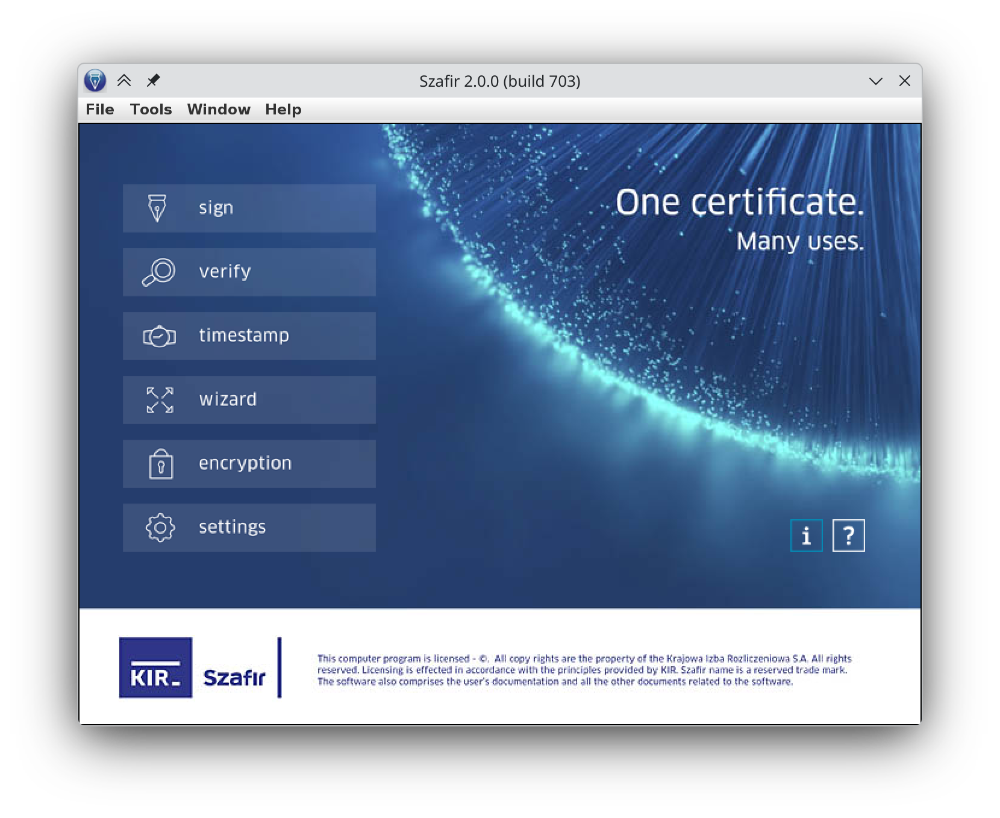
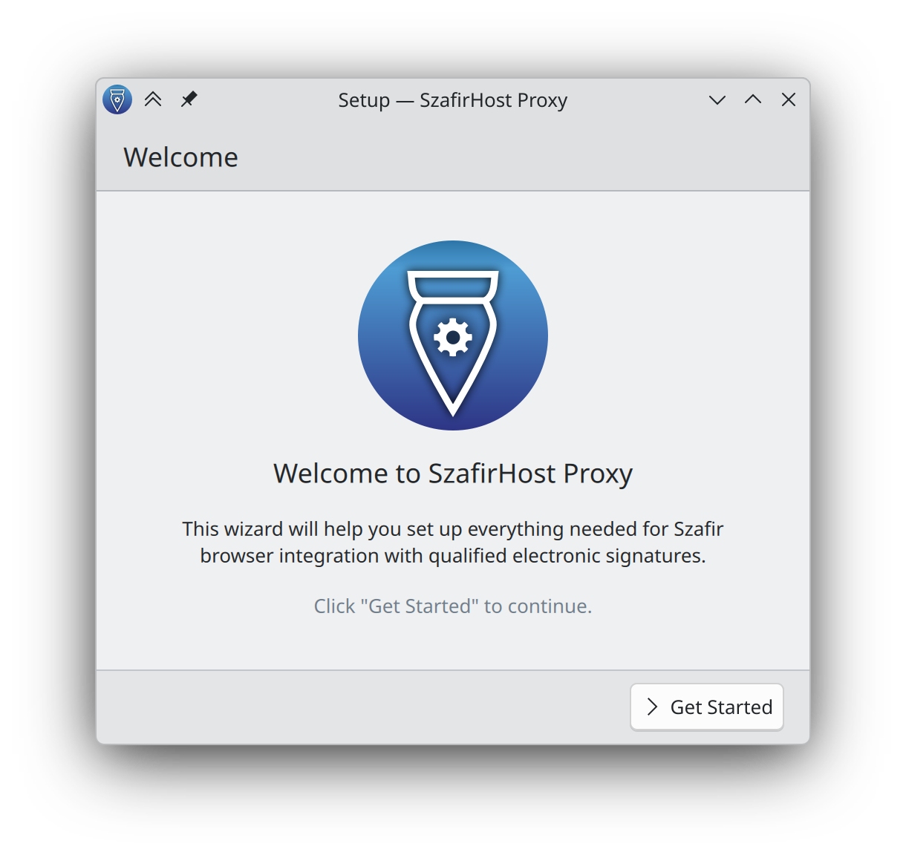
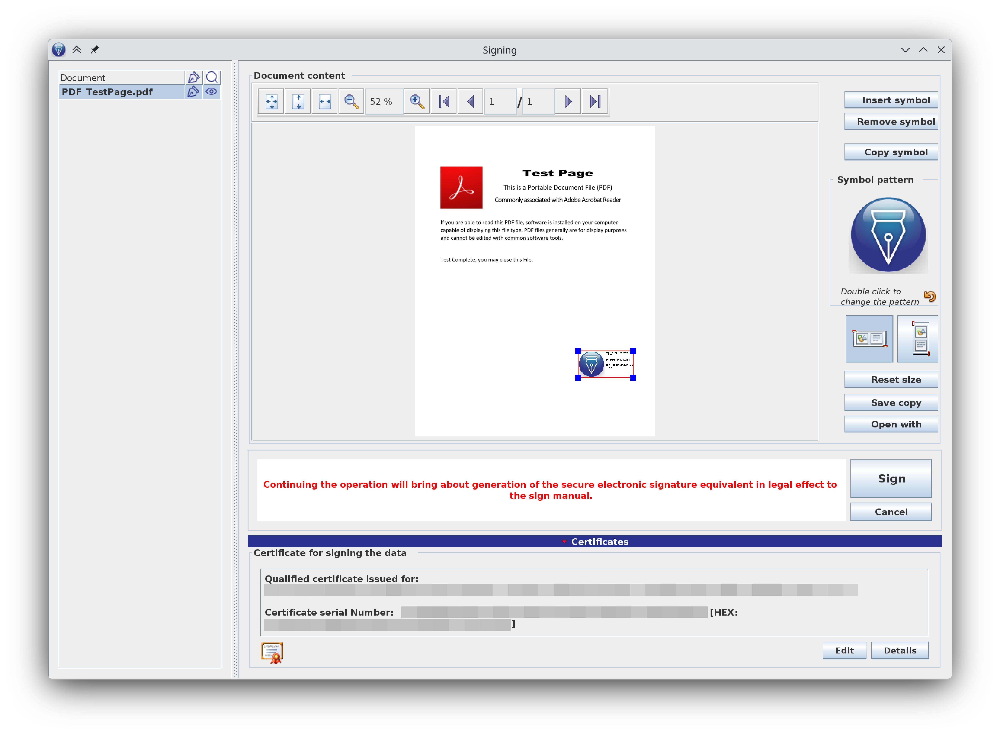
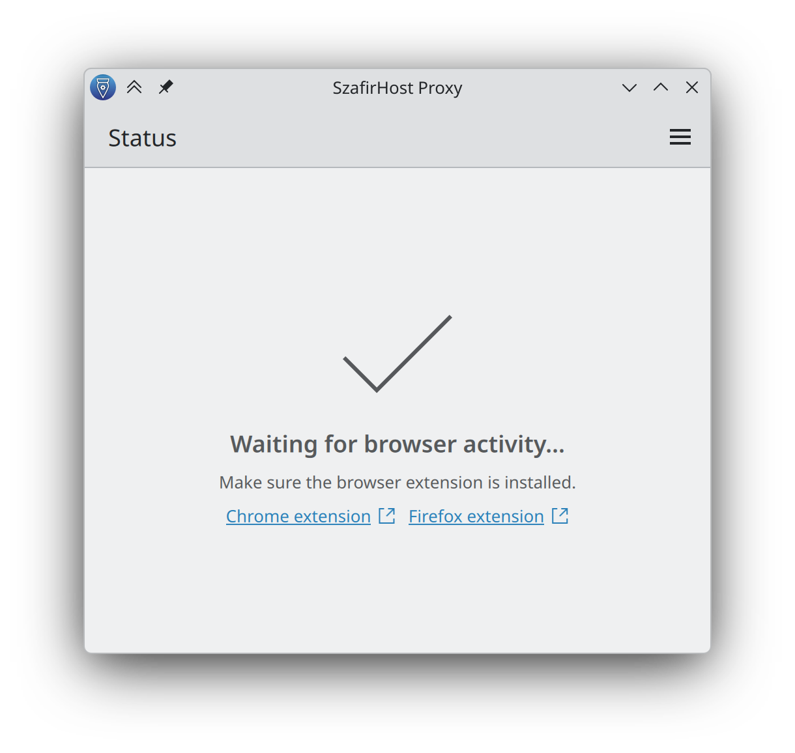
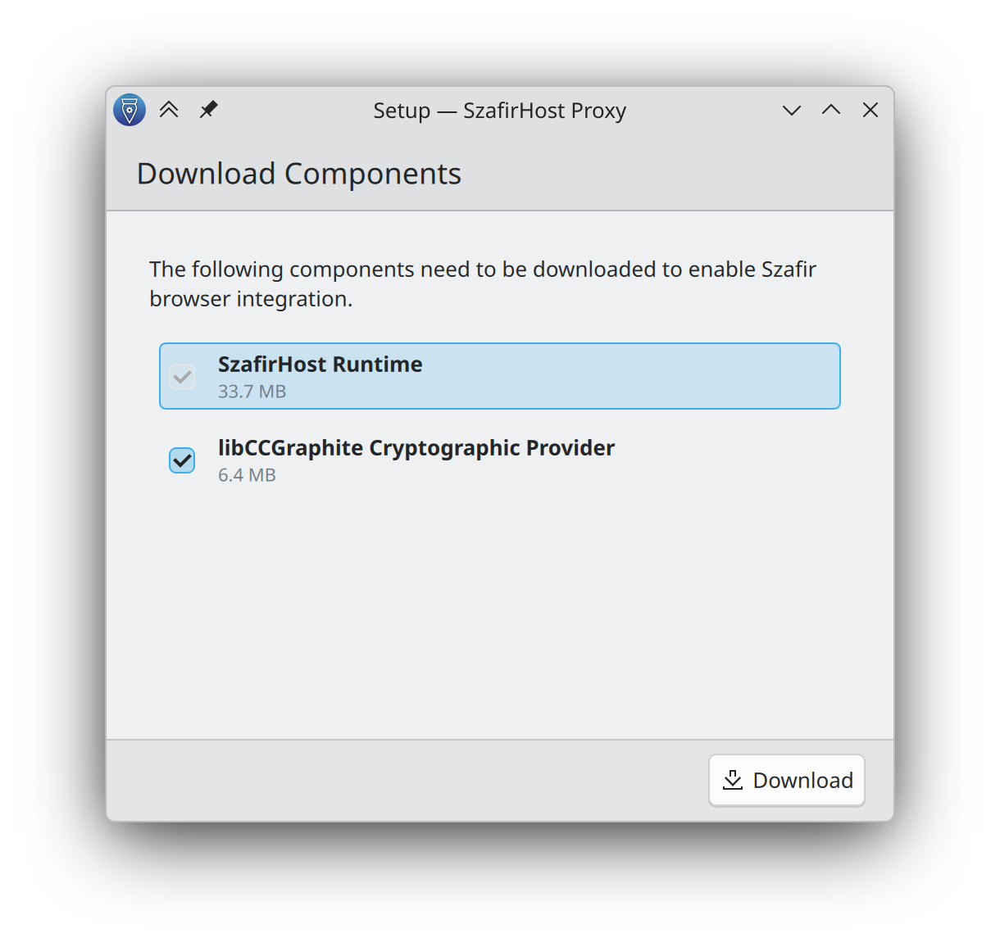

<div align="center">

# Szafir Flatpak Repository

[English](README.md) | [Polski](README.pl.md)

Community-maintained Flatpak packaging for Szafir on Linux.

Install the standalone desktop signer and the browser-signing proxy from one signed repository published by this project.

[Install the repository](https://deno.github.io/szafir-flatpak/szafir.flatpakrepo)

</div>

## What you can install

<table>
  <tr>
    <td width="50%" valign="top">
      <h3>Szafir</h3>
      <p>The standalone desktop application for signing, verifying, timestamping, encrypting, and managing qualified electronic signature workflows.</p>
      <p><strong>Flatpak ID:</strong> <code>pl.kir.szafir</code></p>
      
    </td>
    <td width="50%" valign="top">
      <h3>SzafirHost Proxy</h3>
      <p>An open-source bridge that connects supported browsers with the Szafir environment so signing on supported websites works from Flatpak and host-installed browsers.</p>
      <p><strong>Flatpak ID:</strong> <code>pl.deno.kir.szafirhostproxy</code></p>
      
    </td>
  </tr>
</table>

## Why this repository exists

- `pl.kir.szafir` packages the official Szafir desktop application in Flatpak form.
- `pl.deno.kir.szafirhostproxy` provides the browser bridge and first-run setup needed for website-based signing.
- The published proxy build keeps copyrighted runtime components out of the Flatpak image itself.
- On first launch, the proxy can download required upstream runtime components directly from their original sources after showing the setup flow and license.
- Releases are published as a signed Flatpak repository on GitHub Pages and can be added directly with `flatpak remote-add`.

## Screenshots

### Szafir

<p>
  
  
</p>

### SzafirHost Proxy

<p>
  
  
</p>

## Install

The generated repository is published at:

```text
https://deno.github.io/szafir-flatpak/szafir.flatpakrepo
```

Add it once:

```bash
flatpak remote-add --user --if-not-exists szafir https://deno.github.io/szafir-flatpak/szafir.flatpakrepo
```

Install whichever package you need:

```bash
flatpak install --user szafir pl.kir.szafir
flatpak install --user szafir pl.deno.kir.szafirhostproxy
```

Or install both together:

```bash
flatpak install --user szafir pl.kir.szafir pl.deno.kir.szafirhostproxy
```

## First launch

### Szafir

1. Launch `pl.kir.szafir`.
2. If your workflow needs the Graphite PKCS#11 library, point Szafir at `/app/extra/libCCGraphiteP11.2.0.5.6.so` in the technical component settings.
3. By default the Flatpak can access the Documents folder. If you need other locations, grant them with Flatseal or Flatpak overrides.

### SzafirHost Proxy

1. Launch `pl.deno.kir.szafirhostproxy` once.
2. Complete the setup wizard.
3. Let it download the required runtime components from upstream if prompted.
4. Accept the upstream license in the built-in license screen.
5. Install the browser extension for your browser:
   - Chrome and Chromium family: https://chromewebstore.google.com/detail/szafir-sdk-web/gjalhnomhafafofonpdihihjnbafkipc
    - Firefox: https://www.elektronicznypodpis.pl/download/webmodule/firefox/szafir_sdk_web-current.xpi

After setup, the proxy stays available and waits for browser activity.

## Supported browsers for proxy integration

<table>
  <tr>
    <th>Browser</th>
    <th>Host</th>
    <th>Flatpak</th>
  </tr>
  <tr><td>Firefox</td><td>✅</td><td>✅</td></tr>
  <tr><td>LibreWolf</td><td>✅</td><td>✅</td></tr>
  <tr><td>Waterfox</td><td>✅</td><td>✅</td></tr>
  <tr><td>Google Chrome</td><td>✅</td><td>✅</td></tr>
  <tr><td>Google Chrome Dev</td><td>✅</td><td>✅</td></tr>
  <tr><td>Chromium</td><td>✅</td><td>✅</td></tr>
  <tr><td>Ungoogled Chromium</td><td>✅</td><td>✅</td></tr>
</table>

## Notes

- This repository is community-maintained and is not an official KIR release channel.
- Current release automation builds Linux `x86_64` artifacts.
- The proxy can remove its browser integrations with `flatpak run pl.deno.kir.szafirhostproxy --uninstall`.

