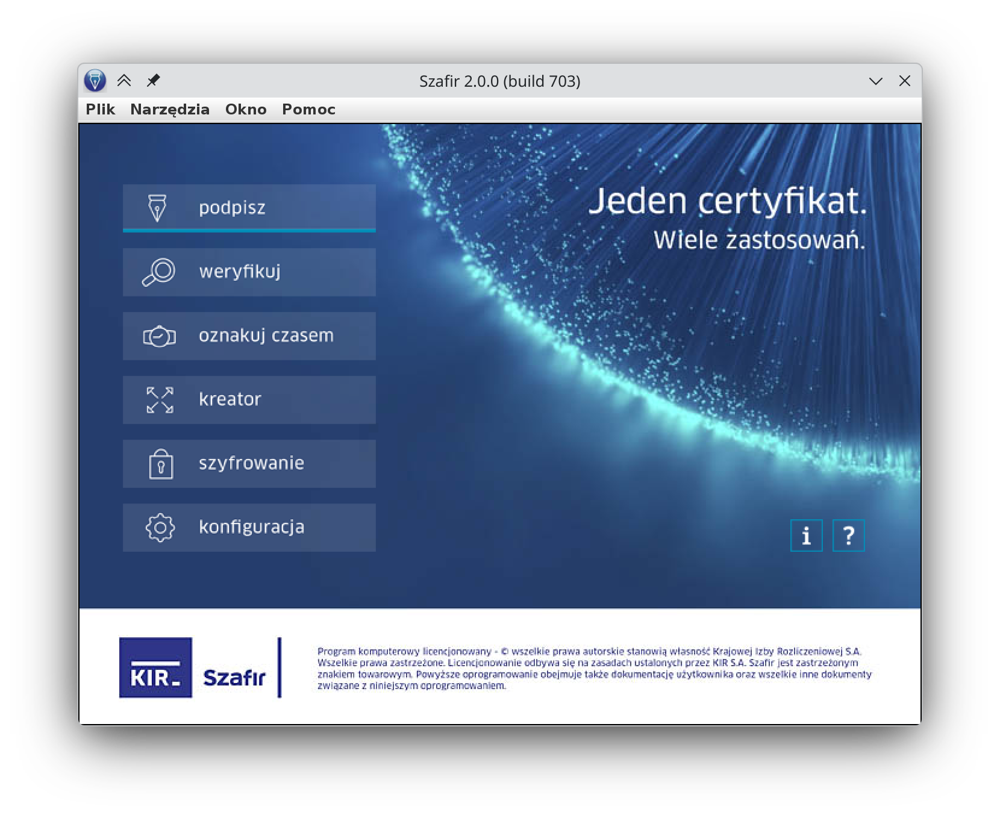
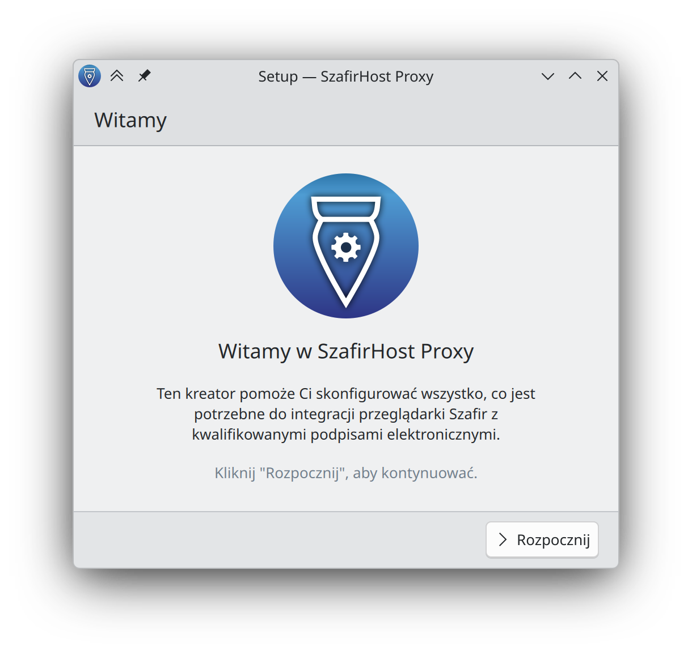
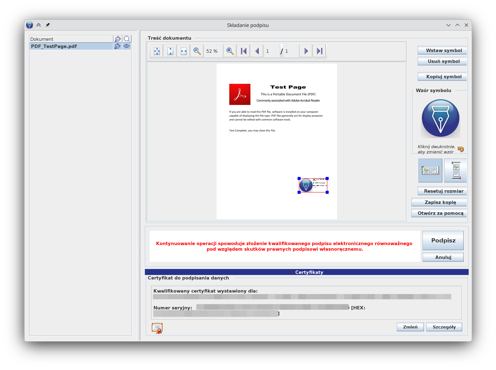
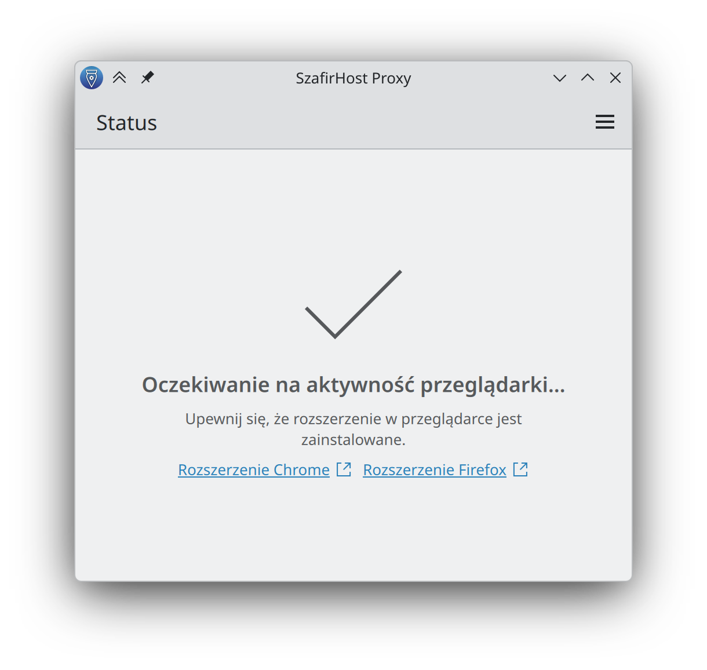
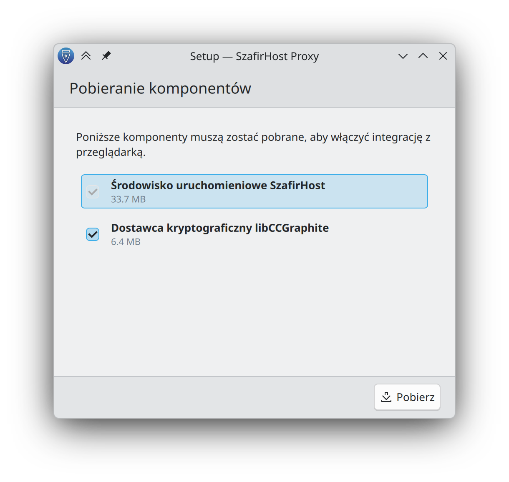

<div align="center">

# Repozytorium Flatpak Szafir

[English](README.md) | [Polski](README.pl.md)

Społecznościowe pakiety Flatpak dla środowiska Szafir na Linuksie.

Zainstaluj samodzielną aplikację desktopową oraz proxy do podpisu w przeglądarce z jednego podpisanego repozytorium publikowanego przez ten projekt.

[Zainstaluj repozytorium](https://deno.github.io/szafir-flatpak/szafir.flatpakrepo)

</div>

## Co można zainstalować

<table>
  <tr>
    <td width="50%" valign="top">
      <h3>Szafir</h3>
      <p>Samodzielna aplikacja desktopowa do podpisywania, weryfikacji, znakowania czasem, szyfrowania i obsługi kwalifikowanych podpisów elektronicznych.</p>
      <p><strong>Flatpak ID:</strong> <code>pl.kir.szafir</code></p>
      
    </td>
    <td width="50%" valign="top">
      <h3>SzafirHost Proxy</h3>
      <p>Otwartoźródłowy most łączący wspierane przeglądarki ze środowiskiem Szafir, aby podpis na obsługiwanych stronach WWW działał zarówno dla aplikacji hosta, jak i przeglądarek Flatpak.</p>
      <p><strong>Flatpak ID:</strong> <code>pl.deno.kir.szafirhostproxy</code></p>
      
    </td>
  </tr>
</table>

## Po co istnieje to repozytorium

- `pl.kir.szafir` pakuje oficjalną aplikację desktopową Szafir w formacie Flatpak.
- `pl.deno.kir.szafirhostproxy` dostarcza most przeglądarkowy i pierwszą konfigurację potrzebną do podpisywania na stronach WWW.
- Publikowane wydanie proxy nie zawiera komponentów objętych prawami autorskimi wewnątrz obrazu Flatpak.
- Przy pierwszym uruchomieniu proxy może pobrać wymagane komponenty producenta bezpośrednio z ich oryginalnych źródeł po przejściu kreatora i akceptacji licencji.
- Wydania są publikowane jako podpisane repozytorium Flatpak w GitHub Pages i można je dodać bezpośrednio przez `flatpak remote-add`.

## Zrzuty ekranu

### Szafir

<p>
  
  
</p>

### SzafirHost Proxy

<p>
  
  
</p>

## Instalacja

Wygenerowane repozytorium jest publikowane pod adresem:

```text
https://deno.github.io/szafir-flatpak/szafir.flatpakrepo
```

Dodaj je tylko raz:

```bash
flatpak remote-add --user --if-not-exists szafir https://deno.github.io/szafir-flatpak/szafir.flatpakrepo
```

Zainstaluj wybrany pakiet:

```bash
flatpak install --user szafir pl.kir.szafir
flatpak install --user szafir pl.deno.kir.szafirhostproxy
```

Albo zainstaluj oba naraz:

```bash
flatpak install --user szafir pl.kir.szafir pl.deno.kir.szafirhostproxy
```

## Pierwsze uruchomienie

### Szafir

1. Uruchom `pl.kir.szafir`.
2. Jeśli Twój scenariusz wymaga biblioteki Graphite PKCS#11, wskaż w ustawieniach komponentu technicznego ścieżkę `/app/extra/libCCGraphiteP11.2.0.5.6.so`.
3. Domyślnie Flatpak ma dostęp do folderu Dokumenty. Jeśli potrzebujesz innych lokalizacji, nadaj je przez Flatseal albo własne nadpisania Flatpak.

### SzafirHost Proxy

1. Uruchom jednorazowo `pl.deno.kir.szafirhostproxy`.
2. Przejdź przez kreator konfiguracji.
3. Jeśli pojawi się taka potrzeba, pozwól na pobranie wymaganych komponentów producenta.
4. Zaakceptuj licencję producenta wbudowaną w ekran konfiguracji.
5. Zainstaluj rozszerzenie dla swojej przeglądarki:
   - Chrome i rodzina Chromium: https://chromewebstore.google.com/detail/szafir-sdk-web/gjalhnomhafafofonpdihihjnbafkipc
   - Firefox: https://www.elektronicznypodpis.pl/download/webmodule/firefox/szafir_sdk_web-current.xpi

Po konfiguracji proxy pozostaje aktywne i czeka na aktywność przeglądarki.

## Wspierane przeglądarki dla integracji proxy

<table>
  <tr>
    <th>Przeglądarka</th>
    <th>Host</th>
    <th>Flatpak</th>
  </tr>
  <tr><td>Firefox</td><td>✅</td><td>✅</td></tr>
  <tr><td>LibreWolf</td><td>✅</td><td>✅</td></tr>
  <tr><td>Waterfox</td><td>✅</td><td>✅</td></tr>
  <tr><td>Google Chrome</td><td>✅</td><td>✅</td></tr>
  <tr><td>Google Chrome Dev</td><td>✅</td><td>✅</td></tr>
  <tr><td>Chromium</td><td>✅</td><td>✅</td></tr>
  <tr><td>Ungoogled Chromium</td><td>✅</td><td>✅</td></tr>
</table>

## Uwagi

- To repozytorium jest utrzymywane społecznościowo i nie stanowi oficjalnego kanału dystrybucji KIR.
- Proxy może usunąć integracje przeglądarkowe poleceniem `flatpak run pl.deno.kir.szafirhostproxy --uninstall`.